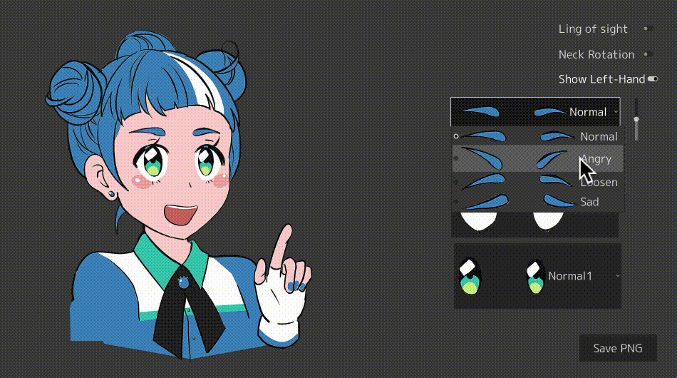

# godotte_editor

これは Godot Engineのマスコットキャラである Godotte ちゃんの画像を作成するツールです。
Godotに関する記事や動画を作るときのサムネイルとして使えるかもしれません。

## 使い方
各種パーツを選びます。眉毛だけ位置が調整できます。

"Ling of sight" を有効にすると、右ドラッグで視線が変えられます。
"Neck Rotation" を有効にすると、右ドラッグで首の傾きが変えられます。

"Save PNG" で PNG 画像を出力します。

